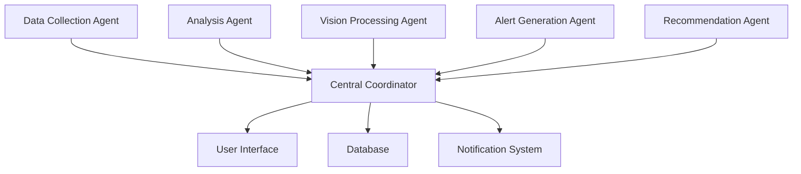

# 🌆 MetroMind
### *Live City Intelligence for Bengaluru Citizens*

<div align="center">

[](https://web.dev/progressive-web-apps/)
[](https://nextjs.org/)
[](https://www.typescriptlang.org/)
[](https://ai.google.dev/)
[](https://developer.mozilla.org/en-US/docs/Web/Progressive_web_apps)


*Real-time city intelligence powered by coordinated AI agents*

[🚀 Live Demo](https://metromind-one.vercel.app) • [📱 Install PWA](https://metromind-one.vercel.app) • [📖 Documentation](#documentation)

</div>

---

## ✨ What is MetroMind?

MetroMind transforms how citizens interact with their city by providing **real-time intelligence** through coordinated AI agents. Experience Bengaluru's living pulse through an intuitive mobile-first Progressive Web App that aggregates, analyzes, and visualizes city data in real-time.

### 🎯 Core Vision
> *"Every citizen deserves to feel the pulse of their city - from traffic patterns to air quality, from social sentiment to emergency alerts. MetroMind makes city intelligence accessible, actionable, and beautiful."*

---

## 🌟 Key Features

### 📱 **Mobile-First PWA Experience**
- **Installable**: Works like a native app on any device
- **Offline Support**: Basic functionality even without internet
- **Push Notifications**: Real-time alerts and updates
- **Lightning Fast**: Optimized for 3G networks and low-end devices

### 🤖 **AI-Powered Intelligence**
- **Multi-Agent Coordination**: 5 specialized AI agents working together
- **Real-time Analysis**: Gemini AI processes images, text, and patterns
- **Predictive Insights**: Anticipate traffic, weather, and crowd patterns
- **Smart Categorization**: Automatic incident classification and priority

### 🗺️ **Interactive City Mapping**
- **OpenStreetMap Integration**: Free, open-source mapping
- **Live Heat Maps**: Traffic, air quality, and incident density
- **Geo-tagged Reports**: Precise location-based incident reporting
- **Dynamic Layers**: Toggle between different city metrics

### 📊 **Real-time Data Dashboard**
- **Live Metrics**: Weather, AQI, traffic, social sentiment
- **Trend Analysis**: Historical patterns and predictions
- **Personalized Alerts**: Location-based notifications
- **Community Insights**: Crowdsourced intelligence

### 🚨 **Intelligent Reporting System**
- **Photo/Video Upload**: AI-powered incident verification
- **Voice Reports**: Speak your concerns naturally
- **Auto-categorization**: Smart classification of issues
- **Impact Tracking**: See how your reports create change

---

## 🏗️ Architecture

### **🎨 Frontend - Mobile-First PWA**
```
Next.js 15 + TypeScript + Tailwind CSS
├── 📱 Progressive Web App (PWA)
├── 🎨 shadcn/ui Components
├── 🗺️ OpenStreetMap + Leaflet
├── 📸 Camera & Media APIs
├── 🔔 Push Notifications
└── ⚡ Optimized Performance
```

### **☁️ Backend - Clerk Auth + Cloud Services**
```
Clerk Authentication + Cloud Functions
├── 🔐 Clerk Authentication
├── 💾 Local Storage / Cloud DB
├── 📁 Cloud Storage
├── 🤖 Gemini AI
├── 📍 OpenStreetMap APIs
└── 🔔 Notifications
```

### **🤖 AI Agent System**
```
Coordinated Multi-Agent Architecture
├── 📊 Data Collection Agent
├── 🔍 Analysis Agent
├── 📸 Vision Processing Agent
├── 🚨 Alert Generation Agent
└── 🎯 Recommendation Agent
```

---

## 🚀 Quick Start

### **📱 For Citizens (Users)**

**Option 1: Install PWA (Recommended)**
1. Visit [metromind-one.vercel.app](https://metromind-one.vercel.app) on your mobile device
2. Tap the "Install" button or "Add to Home Screen"
3. Launch from your home screen like any native app!

**Option 2: Use in Browser**
- Simply visit the URL and start using immediately
- Works on any modern browser (Chrome, Safari, Firefox)

### **👨‍💻 For Developers**

```bash
# 1. Clone the repository
git clone https://github.com/Aakashdeep-Srivastava/metromind.git
cd metromind

# 2. Install dependencies
pnpm install

# 3. Set up environment variables
cp .env.example .env.local
# Edit .env.local with your Clerk keys

# 4. Start development
pnpm dev

# 5. Visit your local app
open http://localhost:3000
```

---

## 🛠️ Installation & Setup

### **Prerequisites**
- Node.js 18+ and pnpm
- Clerk account (for authentication)
- Modern web browser

### **API Keys Required**
- 🔐 Clerk Authentication Keys
- 🤖 Google Gemini AI API (optional)
- 🗺️ OpenStreetMap (free, no key required)

### **Environment Configuration**

Create `.env.local` in the project directory:

```bash
# Clerk Authentication (Required)
NEXT_PUBLIC_CLERK_PUBLISHABLE_KEY=pk_test_...
CLERK_SECRET_KEY=sk_test_...

# Optional APIs
NEXT_PUBLIC_GEMINI_API_KEY=your_gemini_api_key

# App Config
NEXT_PUBLIC_APP_NAME=MetroMind
NEXT_PUBLIC_APP_URL=http://localhost:3000
```

### **Development Commands**

```bash
# Development
pnpm dev              # Start development server
pnpm build            # Build for production
pnpm start            # Start production server
pnpm lint             # Run ESLint
pnpm type-check       # TypeScript checking
```

---

## 📱 Mobile-First Design

### **🎨 Design Philosophy**
- **Touch-First**: Every interaction optimized for touch
- **Thumb-Friendly**: Important actions within thumb reach
- **Performance-Focused**: Smooth 60fps animations
- **Accessible**: WCAG 2.1 AA compliant

### **📐 Responsive Breakpoints**
```css
Mobile:    320px - 768px   (Primary focus)
Tablet:    768px - 1024px  (Enhanced experience)
Desktop:   1024px+         (Full features)
```

### **⚡ Performance Standards**
- **Lighthouse Score**: 90+ on all metrics
- **First Contentful Paint**: < 1.5s
- **Largest Contentful Paint**: < 2.5s
- **Bundle Size**: < 250KB gzipped

---

## 🤖 AI Agent Coordination

### **Agent Architecture**



### **🔄 Agent Workflows**

**1. Data Collection Agent**
- Monitors multiple data sources (weather, traffic, social media)
- Aggregates real-time city metrics
- Validates data quality and consistency

**2. Analysis Agent**
- Processes collected data for patterns
- Generates insights and trends
- Performs predictive analysis

**3. Vision Processing Agent**
- Analyzes user-submitted photos/videos
- Verifies incident authenticity
- Extracts location and context information

**4. Alert Generation Agent**
- Creates targeted notifications
- Prioritizes alerts by urgency and relevance
- Manages notification delivery

**5. Recommendation Agent**
- Suggests optimal routes and timing
- Provides personalized city insights
- Recommends actions based on current conditions

---

## 🔒 Privacy & Security

### **🛡️ Data Protection**
- **End-to-End Encryption**: All sensitive data encrypted
- **Minimal Data Collection**: Only essential information stored
- **User Consent**: Explicit permission for location and camera
- **GDPR Compliant**: Right to delete and data portability

### **🔐 Security Measures**
- **Authentication**: Clerk Auth with Google OAuth
- **API Security**: Rate limiting and key validation
- **Content Security Policy**: XSS and injection protection
- **Secure Headers**: HTTPS enforcement and security headers

---

## 🚀 Deployment

### **🌍 Production Deployment**

```bash
# Frontend (Vercel)
pnpm build
vercel deploy --prod
```

---

## 🤝 Contributing

We welcome contributions! Here's how to get started:

### **💻 Code Contributions**
```bash
# 1. Fork and clone
git clone https://github.com/your-username/metromind.git

# 2. Create feature branch
git checkout -b feature/amazing-feature

# 3. Make changes and test
pnpm lint
pnpm type-check

# 4. Commit with conventional commits
git commit -m "feat: add amazing feature"

# 5. Push and create PR
git push origin feature/amazing-feature
```

---

## 🛠️ Built With

- [Next.js](https://nextjs.org/) - React framework
- [TypeScript](https://www.typescriptlang.org/) - Type safety
- [Tailwind CSS](https://tailwindcss.com/) - Styling
- [shadcn/ui](https://ui.shadcn.com/) - UI components
- [Clerk](https://clerk.com/) - Authentication
- [OpenStreetMap](https://www.openstreetmap.org/) - Free mapping
- [Leaflet](https://leafletjs.com/) - Interactive maps
- [Google Gemini](https://ai.google.dev/) - AI/ML capabilities

---

## 📄 License

This project is licensed under the **MIT License** - see the [LICENSE](LICENSE) file for details.

---

## 📞 Support & Contact

### **🆘 Getting Help**
- 💬 **Community**: [GitHub Discussions](https://github.com/Aakashdeep-Srivastava/metromind/discussions)
- 🐛 **Issues**: [GitHub Issues](https://github.com/Aakashdeep-Srivastava/metromind/issues)

---

<div align="center">

**Made with ❤️ for Bengaluru Citizens**

*Bringing AI-powered city intelligence to your fingertips*

[](https://github.com/Aakashdeep-Srivastava/metromind)

</div>
